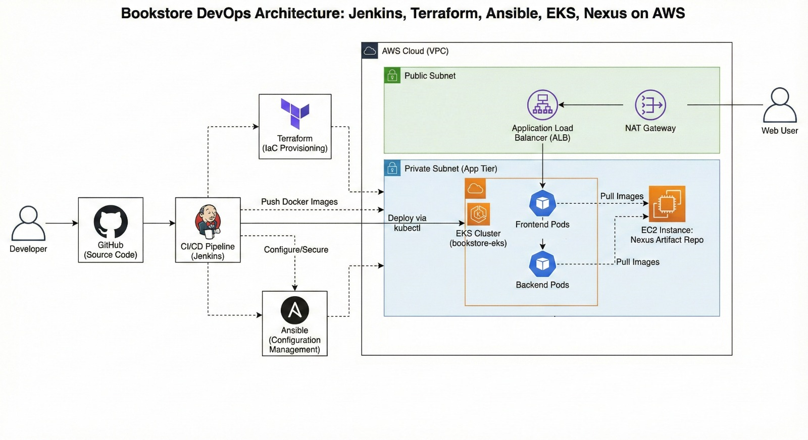
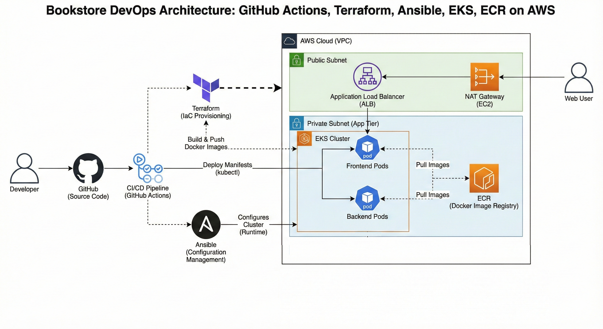

# 📚 Full-Cycle Bookstore Automation

A complete end-to-end DevOps project that demonstrates the full software delivery lifecycle — from building a simple bookstore application to automating infrastructure provisioning, CI/CD pipelines, containerization, and Kubernetes deployment on AWS.

This repository showcases **two different DevOps implementations** using modern tools and best practices.

---

# 📌 Project Overview

This initiative establishes a robust DevOps pipeline for a modern bookstore application on AWS, employing Infrastructure as Code (IaC) principles. We utilise Terraform to provision a production-grade Amazon EKS cluster, complete with essential networking, security, and load-balancing configurations.

GitHub Actions orchestrates the entire Software Delivery Life Cycle (SDLC), from code commits to container image builds, infrastructure deployments, and application rollouts. The bookstore application, composed of frontend and backend microservices, is managed within Kubernetes, with automated deployments driven by Ansible playbooks.

This comprehensive DevOps approach demonstrates how to achieve rapid, reliable, and scalable application delivery while maintaining IaC and robust CI/CD practices.

---

# 📌 Architecture diagrams:
### Diagram of Project 1:



### Diagram of Project 2:




# 🏗️ High-Level Architecture

**Cloud Provider:** AWS  
**Orchestration:** Kubernetes (EKS)

Main components:
- AWS VPC with public & private subnets
- NAT Gateway, Route Tables, Internet Gateway
- EC2 instances
- Amazon EKS cluster with managed node groups
- Application Load Balancer or Cluster Load Balancer
- CI/CD pipelines
- Artifact & container registries

  ---

# 📂 Repository Structure

```bash
.
DEPI-final-project/
├── Project1/
│   ├── terraform/             # Terraform scripts for AWS infrastructure
│   ├── ansible/               # Ansible playbooks for configuration
│   ├── Jenkimsfile            # Jenkins pipeline definition
│   └── k8s/                   # Kubernetes manifests for deployment
│
│
├── Project-2/
│   ├── bookstore-devops/
│   │   ├── terraform/             # Terraform scripts for AWS infrastructure
│   │   ├── ansible/               # Ansible playbooks
│   │   ├── github-actions/        # GitHub Actions workflows for CI/CD
│   │   └── kubernetes/            # Kubernetes manifests for deployment
│   │
│   └── bookstore-app-v2/
│       ├── backend/               # Backend code for bookstore application
│       ├── frontend/              # Frontend code for bookstore application
│       ├── Dockerfile             # Dockerfile for containerizing the app
│       └── README.md              # Optional README for the app itself
│
├── Diagram1.png                   # Architecture diagram for Project 1
├── Diagram2.png                   # Architecture diagram for Project 2
│
└── README.md                  # Root README.md covering full project

```
---

# 🧭 Project Phases Overview

## Prject 1 Phases:

| Phase | Stage | Tool | Purpose |
|------|-------|------|---------|
| Phase 1 | Development | Local Repository | Application code development |
| Phase 2 | Infrastructure | Terraform | Provision AWS resources |
| Phase 3 | Configration | Ansible | configure jenkins and nexus servers |
| Phase 4 | Pipeline | Jenkins | Build and Push docker images to nexus repo then connect to EKS deployment |
| Phase 5 | Deployment | Amazon EKS | Run and manage application containers then deply using loud balancer k8s service|

## Prject 2 Phases:

| Phase | Stage | Tool | Purpose |
|------|-------|------|---------|
| Phase 1 | Development | Local Repository | Application code development |
| Phase 2 | CI/CD | GitHub Actions | Build and push Docker images |
| Phase 3 | Registry | Amazon ECR | Store and manage Docker images |
| Phase 4 | Infrastructure | Terraform | Provision AWS resources |
| Phase 5 | Configuration | Ansible | Configure systems and apply Kubernetes manifests |
| Phase 6 | Deployment | Amazon EKS | Run and manage application containers |

---

# 🔮 Future Improvements

• Improvement in Application

• Add monitoring with Prometheus & Grafana

• Add more features

---

# ▶️ Project 1 Resources:

[!🎬[Demo Video](https://drive.google.com/file/d/18imYXqB4_ruSp2dD68rEinkiTgiUTp2l/view?usp=sharing)]

---

# 👨‍💻 Contributors

• **Nora Nasser** - DevOps Engineer

• **Nada Hussien** - DevOps Engineer

• **Hagar Mohamed** - DevOps Engineer
